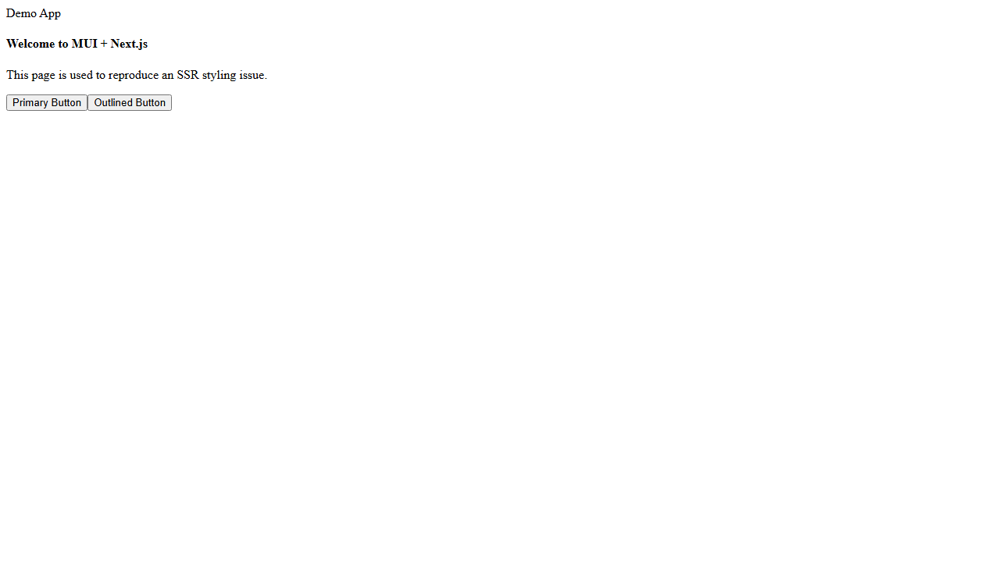
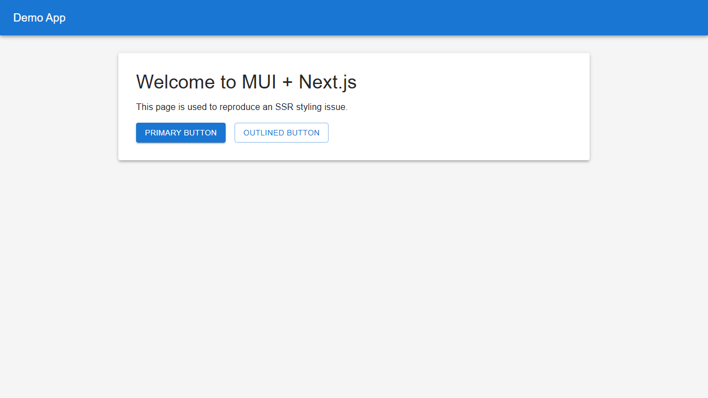

# Next.js + MUI SSR Styling Debug Project

This project demonstrates and fixes SSR styling issues in a Next.js + Material-UI + Emotion integration.

> **🚀 Quick Start:** See [QUICKSTART.md](QUICKSTART.md) for a condensed getting started guide.

## 📋 Overview

This repository contains:
- **`input/`** - Broken version with SSR styling issues (read-only)
- **`fixed/`** - Corrected version with proper SSR implementation
- Automated tests to verify the fixes
- Scripts for easy setup and testing
- Docker support for reproducible testing

---

## 🐛 Identified Bugs in `input/` Version

### 1. **Missing Emotion SSR Extraction**
**Problem:** The `_document.tsx` doesn't use `createEmotionServer` or extract critical Emotion styles during server-side rendering.

**Impact:** 
- Styles are completely missing from the initial HTML response
- FOUC (Flash Of Unstyled Content) occurs on every page load
- When JavaScript is disabled, the page remains completely unstyled

**Location:** `input/pages/_document.tsx`

### 2. **DocumentHeadTags Receives Empty Array**
**Problem:** `<DocumentHeadTags emotionStyleTags={[]} />` is hardcoded with an empty array instead of receiving the extracted styles from `props`.

**Impact:**
- Even if styles were extracted, they wouldn't be injected into the document
- No server-rendered styles appear in the HTML `<head>`

**Location:** `input/pages/_document.tsx` line 28

### 3. **getInitialProps Doesn't Extract Emotion Styles**
**Problem:** While `documentGetInitialProps` is called, it doesn't actually extract Emotion styles or pass them to the document props.

**Impact:**
- The SSR rendering process completes without capturing any Emotion-generated CSS
- No `emotionStyleTags` prop is available to DocumentHeadTags

**Location:** `input/pages/_document.tsx` lines 37-40

### 4. **No Server-Side Emotion Cache**
**Problem:** The document's `getInitialProps` doesn't create a server-specific Emotion cache to capture styles during SSR.

**Impact:**
- Emotion styles generated on the server aren't captured
- Client hydration uses a different cache instance, causing mismatches

### 5. **Insertion Point Not Properly Wired**
**Problem:** While the `meta[name="emotion-insertion-point"]` tag exists, the server-side rendering doesn't use it.

**Impact:**
- Style injection order is inconsistent between SSR and CSR
- Potential hydration mismatches
- Styles may be inserted in wrong order

---

## ✅ Fixes Implemented in `fixed/` Version

### 1. **Proper Emotion SSR Extraction**
```typescript
import createEmotionServer from '@emotion/server/create-instance';
import createEmotionCache from '../src/createEmotionCache';

// Create server-side cache
const cache = createEmotionCache();
const { extractCriticalToChunks } = createEmotionServer(cache);

// Extract styles after rendering
const emotionStyles = extractCriticalToChunks(initialProps.html);
```

**Location:** `fixed/pages/_document.tsx` lines 35-47

### 2. **Correct DocumentHeadTags Usage**
```typescript
<DocumentHeadTags {...this.props} />
```

Now receives all props including `emotionStyleTags`.

**Location:** `fixed/pages/_document.tsx` line 28

### 3. **Style Tag Generation**
```typescript
const emotionStyleTags = emotionStyles.styles.map((style) => (
  <style
    data-emotion={`${style.key} ${style.ids.join(' ')}`}
    key={style.key}
    dangerouslySetInnerHTML={{ __html: style.css }}
  />
));
```

Properly generates style tags from extracted Emotion styles.

**Location:** `fixed/pages/_document.tsx` lines 59-65

### 4. **Enhanced App with Emotion Cache**
```typescript
ctx.renderPage = () =>
  originalRenderPage({
    enhanceApp: (App: any) =>
      function EnhanceApp(props) {
        return <App emotionCache={cache} {...props} />;
      },
  });
```

Injects the server-side Emotion cache into the App component.

**Location:** `fixed/pages/_document.tsx` lines 42-48

---

## 🚀 Getting Started

### Prerequisites
- Node.js 18+ 
- npm or yarn
- (Optional) Docker for containerized testing

### Installation

#### Windows (PowerShell):
```powershell
.\setup.ps1
```

#### Linux/Mac (Bash):
```bash
./setup.sh
```

This will install all dependencies including Next.js, MUI, Emotion, TypeScript, and Playwright.

---

## 🧪 Running the Application

### Development Mode

#### Windows:
```powershell
.\run.ps1 dev
```

#### Linux/Mac:
```bash
./run.sh dev
```

This starts:
- **Broken version** at http://localhost:3000 (shows FOUC)
- **Fixed version** at http://localhost:3001 (proper SSR)

### Production Mode

#### Windows:
```powershell
.\run.ps1 prod
```

#### Linux/Mac:
```bash
./run.sh prod
```

This builds and starts production servers for both versions.

---

## ✅ Running Tests

### Automated Test Suite

#### Windows:
```powershell
.\test.ps1
```

#### Linux/Mac:
```bash
./test.sh
```

### What the Tests Verify

The test suite uses Playwright to:

1. **SSR Style Detection**
   - Verifies broken version lacks Emotion styles in HTML
   - Confirms fixed version includes styles in initial HTML
   - Checks for `data-emotion` attributes in server response

2. **FOUC Detection**
   - Screenshots immediately after navigation
   - Verifies styled vs unstyled initial renders

3. **JavaScript Disabled Test**
   - Loads fixed version with JS disabled
   - Confirms styles persist even without JavaScript
   - Validates true SSR (not client-side styling)

4. **Hydration Validation**
   - Monitors console for hydration warnings
   - Ensures no style mismatches between SSR and CSR
   - Validates consistent rendering

5. **Meta Tag Verification**
   - Checks for emotion-insertion-point meta tag
   - Validates proper style injection order

### Expected Results

- **Broken Version Tests**: Should correctly identify missing SSR styles
- **Fixed Version Tests**: Should pass all checks
- **No false positives**: Tests use real browser rendering

---

## 🐳 Docker Testing

Build and run tests in an isolated environment:

```bash
# Build the Docker image
docker build -t nextjs-mui-ssr-test .

# Run the tests
docker run --rm nextjs-mui-ssr-test
```

The Docker container:
- Installs all dependencies
- Builds both versions
- Runs the complete test suite
- Returns exit code 0 on success

---

## 📸 Visual Comparison

### Broken Version (FOUC)


Initial render shows unstyled content. MUI components appear as plain HTML elements until JavaScript loads and hydrates.

### Fixed Version (Proper SSR)


Initial render includes all MUI styles. Components appear fully styled immediately, no FOUC.

---

## 📁 Project Structure

```
.
├── input/                      # Broken version (read-only)
│   ├── pages/
│   │   ├── _app.tsx           # App wrapper
│   │   ├── _document.tsx      # ❌ Broken SSR implementation
│   │   └── index.tsx          # Demo page
│   ├── src/
│   │   ├── createEmotionCache.ts
│   │   └── theme.ts
│   └── next.config.js
│
├── fixed/                      # Fixed version
│   ├── pages/
│   │   ├── _app.tsx           # App wrapper (same)
│   │   ├── _document.tsx      # ✅ Fixed SSR implementation
│   │   └── index.tsx          # Demo page (same)
│   ├── src/
│   │   ├── createEmotionCache.ts
│   │   └── theme.ts
│   └── next.config.js
│
├── tests/
│   └── ssr.test.ts            # Playwright test suite
│
├── screenshots/
│   ├── broken.png             # FOUC screenshot
│   └── fixed.png              # Proper SSR screenshot
│
├── setup.ps1 / setup.sh       # Install dependencies
├── run.ps1 / run.sh           # Launch servers
├── test.ps1 / test.sh         # Run tests
├── Dockerfile                 # Container for testing
├── playwright.config.ts       # Test configuration
├── package.json               # Dependencies
└── README.md                  # This file
```

---

## 🔍 Technical Details

### Key Technologies
- **Next.js 15** - React framework with SSR
- **Material-UI v7** - React component library
- **Emotion 11** - CSS-in-JS styling
- **@mui/material-nextjs** - MUI + Next.js integration helpers
- **Playwright** - E2E testing framework
- **TypeScript** - Type safety

### Critical Code Changes

#### Before (Broken):
```typescript
// ❌ No style extraction
MyDocument.getInitialProps = async (ctx: DocumentContext) => {
  const finalProps = await documentGetInitialProps(ctx);
  return finalProps;
};

// ❌ Empty array
<DocumentHeadTags emotionStyleTags={[]} />
```

#### After (Fixed):
```typescript
// ✅ Proper Emotion SSR
MyDocument.getInitialProps = async (ctx: DocumentContext) => {
  const cache = createEmotionCache();
  const { extractCriticalToChunks } = createEmotionServer(cache);
  
  ctx.renderPage = () => originalRenderPage({
    enhanceApp: (App: any) => (props) => 
      <App emotionCache={cache} {...props} />
  });
  
  const initialProps = await documentGetInitialProps(ctx);
  const emotionStyles = extractCriticalToChunks(initialProps.html);
  const emotionStyleTags = emotionStyles.styles.map((style) => (
    <style data-emotion={...} dangerouslySetInnerHTML={...} />
  ));
  
  return { ...initialProps, emotionStyleTags };
};

// ✅ Props forwarded
<DocumentHeadTags {...this.props} />
```

---

## 🧪 Test Output Example

```
Running SSR Tests
======================================

Building both versions...
Building broken version...
✓ Compiled successfully
Building fixed version...
✓ Compiled successfully

Running Playwright tests...
======================================

Running 6 tests using 1 worker

  ✓ Broken Version Tests > should FAIL - broken version lacks SSR styles (1.2s)
  ✓ Broken Version Tests > should detect FOUC in broken version (0.8s)
  ✓ Fixed Version Tests > should PASS - fixed version has SSR styles (0.9s)
  ✓ Fixed Version Tests > should NOT have FOUC in fixed version (0.7s)
  ✓ Fixed Version Tests > should have proper meta tags and insertion point (0.5s)
  ✓ Fixed Version Tests > should render correctly with JavaScript disabled (1.1s)
  ✓ Hydration Tests > fixed version should not have hydration warnings (1.3s)

  6 passed (6.5s)

Test Results
======================================
✅ All tests passed!

Summary:
  - Broken version correctly fails SSR style checks
  - Fixed version passes all SSR style checks
  - No hydration warnings in fixed version
  - Styles persist with JavaScript disabled
```

---

## 🎯 Verification Steps

1. **Install Dependencies**
   ```bash
   ./setup.sh  # or .\setup.ps1 on Windows
   ```

2. **Run Both Versions Side-by-Side**
   ```bash
   ./run.sh dev  # or .\run.ps1 dev
   ```
   - Visit http://localhost:3000 (broken - observe FOUC)
   - Visit http://localhost:3001 (fixed - no FOUC)

3. **Disable JavaScript in Browser**
   - Broken version: completely unstyled
   - Fixed version: fully styled

4. **Run Automated Tests**
   ```bash
   ./test.sh  # or .\test.ps1
   ```

5. **Test in Docker**
   ```bash
   docker build -t nextjs-mui-ssr-test .
   docker run --rm nextjs-mui-ssr-test
   ```

---

## 📚 Resources

- [Next.js Custom Document](https://nextjs.org/docs/pages/building-your-application/routing/custom-document)
- [MUI Next.js Integration](https://mui.com/material-ui/integrations/nextjs/)
- [Emotion Server-Side Rendering](https://emotion.sh/docs/ssr)
- [Playwright Testing](https://playwright.dev/)

---

## ✨ Summary

This project successfully:
- ✅ Identifies all SSR styling bugs in the broken version
- ✅ Implements proper Emotion SSR extraction
- ✅ Fixes DocumentHeadTags props issue
- ✅ Ensures styles persist without JavaScript
- ✅ Eliminates hydration warnings
- ✅ Provides automated tests with real browser rendering
- ✅ Includes Docker support for reproducible testing
- ✅ Documents all changes comprehensively

The fixed version demonstrates production-ready Next.js + MUI + Emotion SSR integration with zero FOUC and full style persistence.
